# AI Integration Points in the Git Workflow

This diagram illustrates the key points in our AI-augmented SDLC workflow where AI tools can be most effectively integrated, showing the specific tasks and contributions AI can make at each stage of our Git branching strategy.

## AI Integration Diagram

```mermaid
flowchart TD
    subgraph main["Main Branch"]
        A[Code Review] -->|AI| B[PR Evaluation]
    end

    subgraph docs_mvp["docs/mvp Branch"]
        D1[Requirements Generation] -->|AI| D2[Implementation Planning]
        D2 -->|AI| D3[Technical Specification]
        D3 -->|AI| D4[Guidelines & Standards]
        D4 -->|AI| D5[Developer Prompts]
    end

    subgraph phase0_mvp["phase0/mvp Branch"]
        M1[Boilerplate Code] -->|AI| M2[Basic UI Components]
        M2 -->|AI| M3[Core Functionality]
        M3 -->|AI| M4[MVP Evaluation]
        M4 -->|AI| M5[Test Generation]
    end

    subgraph docs_phase1["docs/phase1 Branch"]
        DP1[Requirement Refinement] -->|AI| DP2[Updated Technical Spec]
        DP2 -->|AI| DP3[Phase 1 Planning]
    end

    subgraph phase1_impl["phase1/implementation Branch"]
        P1[Component Development] -->|AI| P2[Data Model Implementation]
        P2 -->|AI| P3[Test Generation]
        P3 -->|AI| P4[Bug Fixing]
        P4 -->|AI| P5[Documentation Updates]
    end

    subgraph docs_phase2["docs/phase2 Branch"]
        DPP1[Phase 2 Requirements] -->|AI| DPP2[Advanced Feature Specs]
    end

    subgraph phase2_impl["phase2/implementation Branch"]
        E1[Advanced Features] -->|AI| E2[UI Refinement]
        E2 -->|AI| E3[Performance Optimization]
        E3 -->|AI| E4[Final Documentation]
    end

    D5 --> PR1[PR Creation & Review]
    PR1 -->|AI| M1
    M5 --> PR2[PR Creation & Review]
    PR2 -->|AI| DP1
    DP3 --> PR3[PR Creation & Review]
    PR3 -->|AI| P1
    P5 --> PR4[PR Creation & Review]
    PR4 -->|AI| DPP1
    DPP2 --> PR5[PR Creation & Review]
    PR5 -->|AI| E1
    E4 --> PR6[PR Creation & Review]

    PR1 --> A
    PR2 --> A
    PR3 --> A
    PR4 --> A
    PR5 --> A
    PR6 --> A

    style main fill:#60B5FF,stroke:#4A91CC,stroke-width:2px,color:#ffffff
    style docs_mvp fill:#AFDDFF,stroke:#60B5FF,stroke-width:2px
    style phase0_mvp fill:#FF9149,stroke:#CC7439,stroke-width:2px
    style docs_phase1 fill:#AFDDFF,stroke:#60B5FF,stroke-width:2px
    style phase1_impl fill:#FF9149,stroke:#CC7439,stroke-width:2px
    style docs_phase2 fill:#AFDDFF,stroke:#60B5FF,stroke-width:2px
    style phase2_impl fill:#FF9149,stroke:#CC7439,stroke-width:2px

    style PR1 fill:#FFECDB,stroke:#FF9149,stroke-width:2px
    style PR2 fill:#FFECDB,stroke:#FF9149,stroke-width:2px
    style PR3 fill:#FFECDB,stroke:#FF9149,stroke-width:2px
    style PR4 fill:#FFECDB,stroke:#FF9149,stroke-width:2px
    style PR5 fill:#FFECDB,stroke:#FF9149,stroke-width:2px
    style PR6 fill:#FFECDB,stroke:#FF9149,stroke-width:2px
```

## AI Integration Points by Branch

The diagram highlights the specific tasks where AI can provide significant value throughout our Git workflow:

1. **docs/mvp Branch**:
   - **Requirements Generation**: AI helps draft comprehensive requirements based on project goals
   - **Implementation Planning**: AI assists in breaking down the project into logical phases
   - **Technical Specification**: AI suggests appropriate technology stacks and architectures
   - **Guidelines & Standards**: AI helps establish coding standards and best practices
   - **Developer Prompts**: AI helps create effective prompts for future development stages

2. **phase0/mvp Branch**:
   - **Boilerplate Code**: AI generates project structure and configuration files
   - **Basic UI Components**: AI creates simple UI components based on requirements
   - **Core Functionality**: AI implements basic versions of core features
   - **MVP Evaluation**: AI helps identify gaps and issues in the MVP
   - **Test Generation**: AI writes basic tests for MVP functionality

3. **docs/phase1 Branch**:
   - **Requirement Refinement**: AI assists in updating requirements based on MVP learnings
   - **Updated Technical Spec**: AI helps refine the technical specification
   - **Phase 1 Planning**: AI assists in planning the implementation of Phase 1

4. **phase1/implementation Branch**:
   - **Component Development**: AI creates more sophisticated components with proper architecture
   - **Data Model Implementation**: AI implements robust data models and storage
   - **Test Generation**: AI writes comprehensive unit and integration tests
   - **Bug Fixing**: AI helps identify and fix issues
   - **Documentation Updates**: AI updates documentation to reflect implementation

5. **docs/phase2 Branch**:
   - **Phase 2 Requirements**: AI helps define requirements for advanced features
   - **Advanced Feature Specs**: AI assists in creating detailed specifications for complex features

6. **phase2/implementation Branch**:
   - **Advanced Features**: AI helps implement more complex features
   - **UI Refinement**: AI suggests UI/UX improvements
   - **Performance Optimization**: AI identifies and resolves performance bottlenecks
   - **Final Documentation**: AI helps finalize all project documentation

7. **Pull Request & Code Review**:
   - **PR Creation**: AI helps draft PR descriptions and summaries of changes
   - **Code Review**: AI assists in reviewing code for issues, bugs, and improvements
   - **PR Evaluation**: AI helps evaluate PRs for merge readiness

This approach ensures AI is integrated throughout the entire development workflow, with specific contributions tailored to each branch and phase of development.
