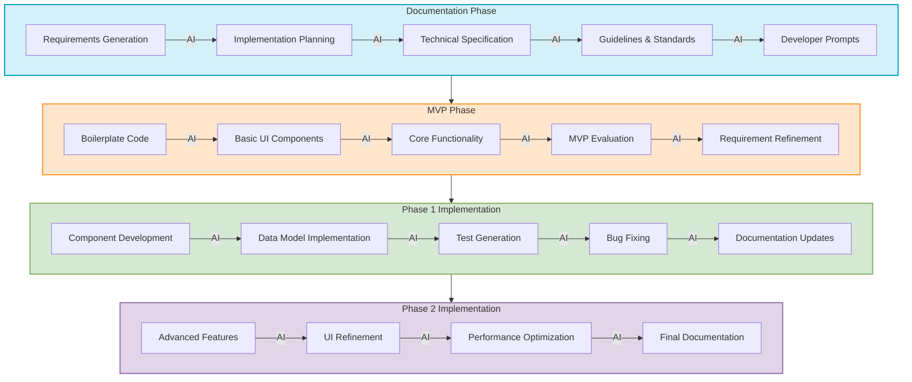

# AI Integration Points Diagram

This diagram illustrates the key points in the development workflow where AI tools can be most effectively integrated, showing the specific tasks and contributions AI can make at each stage.

## Mermaid Diagram Code

## Description

The diagram highlights the specific tasks where AI can provide significant value throughout the development process:

1. **Documentation Phase**:
   - **Requirements Generation**: AI helps draft comprehensive requirements based on project goals
   - **Implementation Planning**: AI assists in breaking down the project into logical phases
   - **Technical Specification**: AI suggests appropriate technology stacks and architectures
   - **Guidelines & Standards**: AI helps establish coding standards and best practices
   - **Developer Prompts**: AI helps create effective prompts for future development stages

2. **MVP Phase**:
   - **Boilerplate Code**: AI generates project structure and configuration files
   - **Basic UI Components**: AI creates simple UI components based on requirements
   - **Core Functionality**: AI implements basic versions of core features
   - **MVP Evaluation**: AI helps identify gaps and issues in the MVP
   - **Requirement Refinement**: AI assists in updating requirements based on MVP learnings

3. **Phase 1 Implementation**:
   - **Component Development**: AI creates more sophisticated components with proper architecture
   - **Data Model Implementation**: AI implements robust data models and storage
   - **Test Generation**: AI writes unit and integration tests
   - **Bug Fixing**: AI helps identify and fix issues
   - **Documentation Updates**: AI updates documentation to reflect implementation

4. **Phase 2 Implementation**:
   - **Advanced Features**: AI helps implement more complex features
   - **UI Refinement**: AI suggests UI/UX improvements
   - **Performance Optimization**: AI identifies and resolves performance bottlenecks
   - **Final Documentation**: AI helps finalize all project documentation

The diagram emphasizes that AI is integrated throughout the entire development process, with specific contributions tailored to each phase and task.
