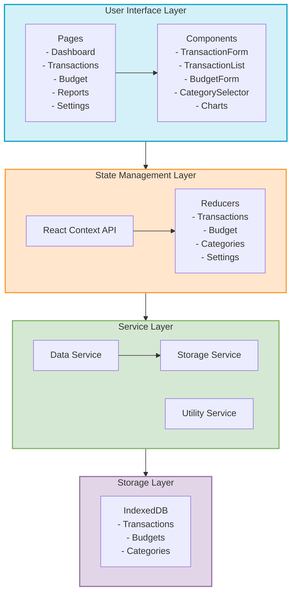

# Application Architecture Diagram

This diagram illustrates the architecture of the Student Budget Tracker application, showing the main components and their relationships.

## Mermaid Diagram Code

## Description

The diagram shows the layered architecture of the Student Budget Tracker application:

1. **User Interface Layer**:
   - **Pages**: Main application views (Dashboard, Transactions, Budget, Reports, Settings)
   - **Components**: Reusable UI components (forms, lists, selectors, charts)

2. **State Management Layer**:
   - **React Context API**: Provides global state management
   - **Reducers**: Handle state updates for different domains (transactions, budget, categories, settings)

3. **Service Layer**:
   - **Data Service**: Handles business logic and data processing
   - **Storage Service**: Manages data persistence operations
   - **Utility Service**: Provides helper functions and utilities

4. **Storage Layer**:
   - **IndexedDB**: Local database for storing application data (transactions, budgets, categories)

The architecture follows these key principles:

- **Separation of concerns**: Each layer has a specific responsibility
- **Unidirectional data flow**: Data flows from UI to State to Services to Storage
- **Modularity**: Components and services are designed to be reusable and maintainable
- **Local-first**: All data is stored locally on the device for Phase 1

This architecture provides a solid foundation for the application while allowing for future expansion in later phases.
