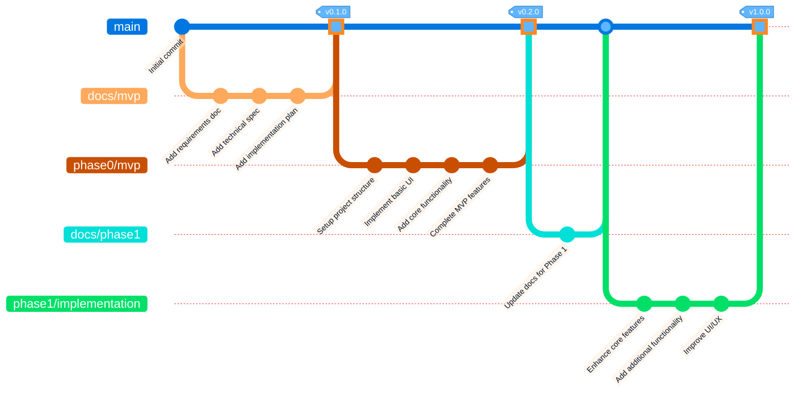

# Git Branching Strategy

This document outlines the Git branching strategy used in the AI-augmented SDLC workflow, showing how different branches relate to each other and the progression of the project.

## Branching Strategy Overview

Our project uses a structured branching strategy with separate branches for documentation and implementation:

- **main**: The primary branch containing stable, reviewed code
- **docs/mvp**: Documentation for the MVP phase
- **phase0/mvp**: Implementation of the MVP features
- **docs/phase1**: Documentation for Phase 1
- **phase1/implementation**: Implementation of Phase 1 features
- **docs/phase2**: Documentation for Phase 2
- **phase2/implementation**: Implementation of Phase 2 features

## Mermaid Diagram

## Detailed Branch Descriptions

1. **main Branch**:
   - Contains stable, reviewed code
   - Serves as the integration branch for completed phases
   - Tagged at significant milestones
   - Never receives direct commits (only through PRs)

2. **docs/mvp Branch**:
   - Contains all MVP documentation
   - Requirements, specifications, and planning documents
   - Merged to main via PR with squash merge

3. **phase0/mvp Branch**:
   - Contains the MVP implementation
   - Basic functionality to validate the concept
   - Merged to main via PR with squash merge

4. **docs/phase1 Branch**:
   - Contains updated documentation for Phase 1
   - Refined requirements based on MVP feedback
   - Merged to main via PR with squash merge

5. **phase1/implementation Branch**:
   - Contains complete implementation of core features
   - Includes tests and updated documentation
   - Merged to main via PR with squash merge

6. **docs/phase2 Branch**:
   - Contains updated documentation for Phase 2
   - Refined requirements based on Phase 1 feedback
   - Merged to main via PR with squash merge

7. **phase2/implementation Branch**:
   - Contains enhanced features and improvements
   - Includes final documentation updates
   - Merged to main via PR with squash merge

## PR and Merge Process

For each branch:
1. Complete the work on the feature branch
2. Push to the remote repository
3. Create a Pull Request to `main`
4. Conduct code review
5. Address feedback
6. Squash merge to maintain a clean commit history
7. Delete the feature branch after merging

## Benefits of This Strategy

This branching strategy ensures:
- Clean separation between documentation and implementation
- Clear history of project evolution through squash merges
- Ability to work on different phases independently
- Proper versioning of significant milestones
- Simplified code review process
- Clean commit history in the main branch
