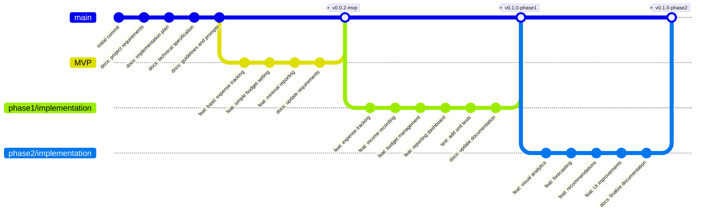

# Git Branching Strategy Diagram

This diagram illustrates the Git branching strategy used in the AI-assisted development workflow, showing how different branches relate to each other and the progression of the project.

## Mermaid Diagram Code

## Description

The diagram shows the Git branching strategy with:

1. **Main Branch**:
   - Contains all documentation commits
   - Serves as the integration branch for completed phases
   - Tagged at significant milestones

2. **MVP Branch**:
   - Branches off from main after documentation is complete
   - Contains basic implementation of core features
   - Merges back to main with tag v0.0.2-mvp

3. **Phase 1 Implementation Branch**:
   - Branches off from main after MVP evaluation
   - Contains complete implementation of core features
   - Includes tests and updated documentation
   - Merges back to main with tag v0.1.0-phase1

4. **Phase 2 Implementation Branch**:
   - Branches off from main after Phase 1 completion
   - Contains enhanced features and improvements
   - Includes final documentation updates
   - Merges back to main with tag v0.1.0-phase2

This branching strategy ensures:
- Clean separation between development phases
- Clear history of project evolution
- Ability to work on different phases independently
- Proper versioning of significant milestones
