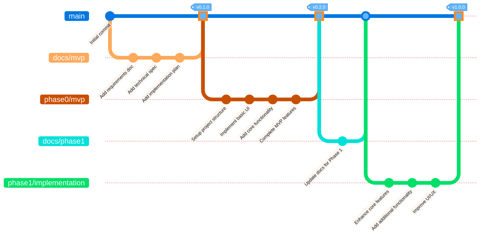

# Git Workflow Diagram

The following diagram illustrates our Git branching strategy and workflow for the AI-augmented SDLC project.

## Workflow Explanation

1. **Documentation First**: We start by creating a `docs/mvp` branch for all MVP documentation
   - Requirements, specifications, and planning documents
   - Merged to `main` via PR with squash merge

2. **MVP Implementation**: We create a `phase0/mvp` branch for the initial implementation
   - Basic functionality to validate the concept
   - Merged to `main` via PR with squash merge

3. **Phase 1 Documentation**: We create a `docs/phase1` branch to update documentation
   - Refined requirements based on MVP feedback
   - Merged to `main` via PR with squash merge

4. **Phase 1 Implementation**: We create a `phase1/implementation` branch for enhanced features
   - Complete core functionality
   - Merged to `main` via PR with squash merge

This pattern continues for subsequent phases, maintaining a clean separation between documentation and implementation work.

## PR and Merge Process

For each branch:
1. Complete the work on the feature branch
2. Push to the remote repository
3. Create a Pull Request to `main`
4. Conduct code review
5. Address feedback
6. Squash merge to maintain a clean commit history
7. Delete the feature branch after merging
