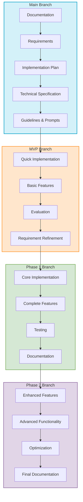

# Workflow Overview Diagram

This diagram illustrates the AI-assisted Git workflow for university projects, showing the progression from documentation to implementation phases.

## Mermaid Diagram Code

## Description

The diagram shows four main phases of development:

1. **Main Branch (Documentation Phase)**:
   - Starting with requirements definition
   - Creating an implementation plan
   - Establishing technical specifications
   - Developing guidelines and prompts

2. **MVP Branch**:
   - Quick implementation of basic features
   - Evaluation of the implementation
   - Refinement of requirements based on findings

3. **Phase 1 Branch**:
   - Implementation of core features
   - Comprehensive testing
   - Documentation of implemented features

4. **Phase 2 Branch**:
   - Implementation of enhanced features
   - Performance optimization
   - Final documentation updates

The arrows between branches show the progression of the project, with each phase building on the learnings from the previous phase.
