# AI-Augmented SDLC Workflow Overview

This diagram illustrates the AI-assisted Git workflow for university projects, showing the progression from documentation to implementation phases with our structured branching strategy.

## Workflow Diagram

```mermaid
flowchart TD
    subgraph main["Main Branch (Integration)"]
        A[Initial Setup] --> Z[Stable, Reviewed Code]
    end

    subgraph docs_mvp["docs/mvp Branch"]
        B[Requirements] --> C[Implementation Plan]
        C --> D[Technical Specification]
        D --> E[Guidelines & Prompts]
    end

    subgraph phase0_mvp["phase0/mvp Branch"]
        F[Quick Implementation] --> G[Basic Features]
        G --> H[Evaluation]
        H --> I[Testing & Refinement]
    end

    subgraph docs_phase1["docs/phase1 Branch"]
        J[Updated Requirements] --> K[Refined Implementation Plan]
        K --> L[Updated Technical Specification]
    end

    subgraph phase1_impl["phase1/implementation Branch"]
        M[Core Implementation] --> N[Complete Features]
        N --> O[Testing]
        O --> P[Documentation Updates]
    end

    subgraph docs_phase2["docs/phase2 Branch"]
        Q[Phase 2 Requirements] --> R[Enhanced Feature Specs]
    end

    subgraph phase2_impl["phase2/implementation Branch"]
        S[Enhanced Features] --> T[Advanced Functionality]
        T --> U[Optimization]
        U --> V[Final Documentation]
    end

    A --> B
    E --> PR1[PR & Squash Merge]
    PR1 --> F
    I --> PR2[PR & Squash Merge]
    PR2 --> J
    L --> PR3[PR & Squash Merge]
    PR3 --> M
    P --> PR4[PR & Squash Merge]
    PR4 --> Q
    R --> PR5[PR & Squash Merge]
    PR5 --> S
    V --> PR6[PR & Squash Merge]

    PR1 --> Z
    PR2 --> Z
    PR3 --> Z
    PR4 --> Z
    PR5 --> Z
    PR6 --> Z

    style main fill:#60B5FF,stroke:#4A91CC,stroke-width:2px,color:#ffffff
    style docs_mvp fill:#AFDDFF,stroke:#60B5FF,stroke-width:2px
    style phase0_mvp fill:#FF9149,stroke:#CC7439,stroke-width:2px
    style docs_phase1 fill:#AFDDFF,stroke:#60B5FF,stroke-width:2px
    style phase1_impl fill:#FF9149,stroke:#CC7439,stroke-width:2px
    style docs_phase2 fill:#AFDDFF,stroke:#60B5FF,stroke-width:2px
    style phase2_impl fill:#FF9149,stroke:#CC7439,stroke-width:2px

    style PR1 fill:#FFECDB,stroke:#FF9149,stroke-width:2px
    style PR2 fill:#FFECDB,stroke:#FF9149,stroke-width:2px
    style PR3 fill:#FFECDB,stroke:#FF9149,stroke-width:2px
    style PR4 fill:#FFECDB,stroke:#FF9149,stroke-width:2px
    style PR5 fill:#FFECDB,stroke:#FF9149,stroke-width:2px
    style PR6 fill:#FFECDB,stroke:#FF9149,stroke-width:2px
```

## Workflow Description

Our AI-augmented SDLC workflow consists of alternating documentation and implementation phases, with each phase building on the learnings from the previous one:

1. **Main Branch**:
   - Serves as the integration branch for all completed work
   - Contains only stable, reviewed code merged via PRs
   - Never receives direct commits

2. **Documentation Branches (docs/mvp, docs/phase1, docs/phase2)**:
   - Separate branches for documentation work in each phase
   - Focus on requirements, specifications, and planning
   - Merged to main via PR with squash merge when complete

3. **Implementation Branches (phase0/mvp, phase1/implementation, phase2/implementation)**:
   - Separate branches for code implementation in each phase
   - Created after corresponding documentation is complete
   - Merged to main via PR with squash merge when complete

4. **Pull Request & Squash Merge Process**:
   - Each branch is merged to main through a PR
   - Code review is conducted on all PRs
   - Squash merges maintain a clean commit history
   - Feature branches are deleted after merging

This workflow ensures:
- Clear separation between documentation and implementation
- Systematic progression through development phases
- Clean commit history in the main branch
- Comprehensive code review process
- Effective collaboration between team members
