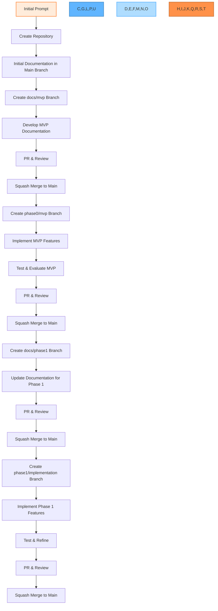

# AI-Augmented SDLC Workflow: Step-by-Step Process

This document outlines the complete workflow for developing projects using the AI-augmented Software Development Life Cycle (SDLC) approach. This methodology combines AI assistance with a structured Git branching strategy to create a systematic, efficient development process.

## Workflow Diagram



## Detailed Steps

### 1. Initial Setup

- Start with an initial prompt to AI describing your project
- Create a new repository with a main branch
- Initialize with basic README and project structure

```bash
# Create a new repository
git init
git add README.md
git commit -m "Initial commit"
```

### 2. Main Branch: Initial Documentation

- Create initial project documentation directly in main
- Include basic project description and goals
- Set up directory structure for future documentation

```bash
# Add initial documentation
mkdir -p docs/{assets,guidelines,mvp,specification}
git add docs/
git commit -m "docs: add initial directory structure"
```

### 3. docs/mvp Branch: MVP Documentation

- Create a new branch for MVP documentation
- Develop comprehensive MVP documentation
- Create PR when documentation is complete
- Review, approve, and squash merge to main

```bash
# Create docs/mvp branch
git checkout -b docs/mvp

# Develop MVP documentation
# ... create/edit documentation files ...

# Commit changes
git add docs/mvp/
git commit -m "docs: add MVP requirements and specifications"

# Push and create PR
git push origin docs/mvp
# Create PR from docs/mvp to main in GitHub/GitLab
# Review, approve, and squash merge
```

### 4. phase0/mvp Branch: MVP Implementation

- Create a new branch for MVP implementation
- Implement MVP features based on documentation
- Test and evaluate the MVP
- Create PR when implementation is complete
- Review, approve, and squash merge to main

```bash
# Create phase0/mvp branch
git checkout main
git pull  # Get the merged documentation
git checkout -b phase0/mvp

# Implement MVP features
# ... create/edit implementation files ...

# Commit changes
git add src/
git commit -m "feat: implement basic expense tracking"

# Push and create PR
git push origin phase0/mvp
# Create PR from phase0/mvp to main in GitHub/GitLab
# Review, approve, and squash merge
```

### 5. docs/phase1 Branch: Phase 1 Documentation

- Create a new branch for Phase 1 documentation
- Update documentation based on MVP learnings
- Create PR when documentation updates are complete
- Review, approve, and squash merge to main

```bash
# Create docs/phase1 branch
git checkout main
git pull  # Get the merged MVP implementation
git checkout -b docs/phase1

# Update documentation for Phase 1
# ... update documentation files ...

# Commit changes
git add docs/
git commit -m "docs: update requirements based on MVP feedback"

# Push and create PR
git push origin docs/phase1
# Create PR from docs/phase1 to main in GitHub/GitLab
# Review, approve, and squash merge
```

### 6. phase1/implementation Branch: Phase 1 Implementation

- Create a new branch for Phase 1 implementation
- Implement Phase 1 features based on updated docs
- Create PR when implementation is complete
- Review, approve, and squash merge to main

```bash
# Create phase1/implementation branch
git checkout main
git pull  # Get the merged Phase 1 documentation
git checkout -b phase1/implementation

# Implement Phase 1 features
# ... create/edit implementation files ...

# Commit changes
git add src/
git commit -m "feat: implement enhanced transaction management"

# Push and create PR
git push origin phase1/implementation
# Create PR from phase1/implementation to main in GitHub/GitLab
# Review, approve, and squash merge
```

### 7. Continue Pattern for Future Phases

- Create docs/phase2 branch for Phase 2 documentation
- Create phase2/implementation branch for Phase 2 implementation
- Follow the same PR and squash merge process

## Key AI Integration Points

Throughout this workflow, AI can be integrated at various points to enhance productivity and quality:

### Documentation Creation
- Generate comprehensive requirements documents
- Create detailed implementation plans
- Develop technical specifications
- Establish coding guidelines and standards

Example prompt:
```
I'm creating a budget tracking application for university students.
Please help me create a detailed requirements document that includes:
1. Project overview
2. Target user description
3. Core problem statement
4. Feature requirements
5. Constraints and assumptions
```

### Code Generation
- Generate boilerplate code
- Create UI components
- Implement core functionality
- Develop data models and storage solutions

Example prompt:
```
Based on the requirements in the specification,
please help me implement a minimal version of
the transaction form component using React
and Material-UI.

Focus on core functionality only, without
advanced features or extensive error handling.
```

### Code Review
- Review code for issues and improvements
- Identify potential bugs
- Suggest optimizations
- Ensure adherence to coding standards

### Testing
- Generate test cases
- Create unit and integration tests
- Identify edge cases
- Validate functionality

### PR Descriptions
- Create clear, comprehensive PR descriptions
- Summarize changes and their impact
- Highlight potential issues or considerations

## Best Practices

1. **Always review AI-generated content** before committing
2. **Understand the code** AI generates for you
3. **Maintain clean commit history** with squash merges
4. **Document thoroughly** at each phase
5. **Test rigorously** before creating PRs
6. **Keep branches focused** on specific tasks or features
7. **Delete branches** after they are merged to main

## Conclusion

This AI-augmented SDLC workflow provides a structured approach to software development that leverages AI assistance while maintaining high quality standards through systematic documentation, implementation, and review processes. By following this workflow, teams can develop software more efficiently while ensuring proper documentation, testing, and code quality.
